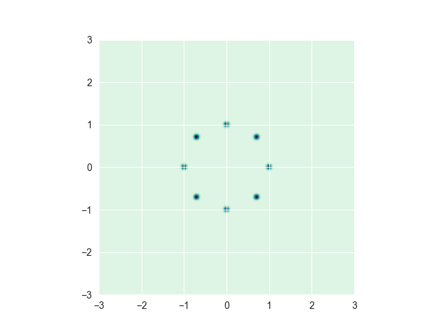
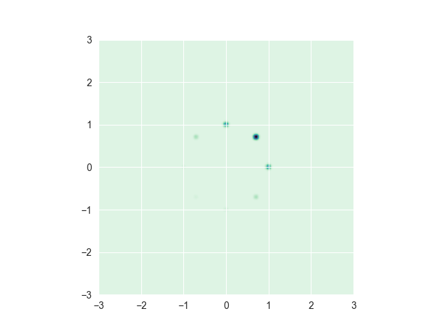
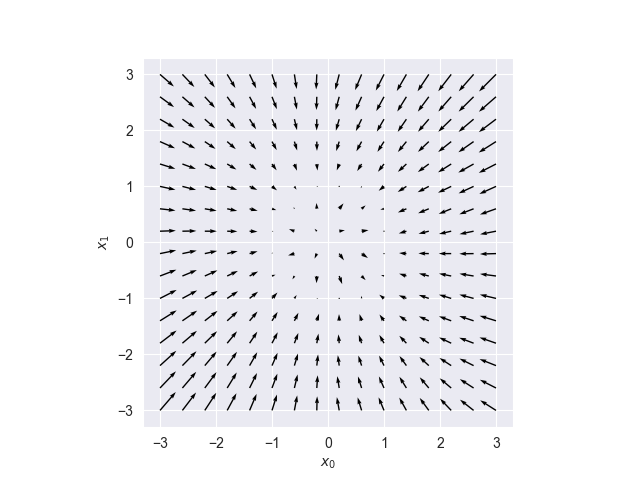

diffusionjax
============
[](https://github.com/bb515/diffusionjax/actions/workflows/CI.yml)
[](https://coveralls.io/github/bb515/diffusionjax?branch=master)
[](https://github.com/psf/black)

diffusionjax is a simple, accessible introduction to diffusion models, also known as score-based generative models (SGMs). It is implemented in Python via the autodiff framework, [JAX](https://github.com/google/jax). In particular, diffusionjax uses the [Flax](https://github.com/google/flax) library for the neural network approximator of the score.

Based off the [Jupyter notebook](https://jakiw.com/sgm_intro) by Jakiw Pidstrigach, a tutorial on the theoretical and implementation aspects of diffusion models.

The development of diffusionjax has been supported by The Alan Turing Institute through the Theory and Methods Challenge Fortnights event "Accelerating generative models and nonconvex optimisation", which took place on 6-10 June 2022 and 5-9 Sep 2022 at The Alan Turing Institute headquarters.

Contents:

- [Installation](#installation)
- [Examples](#examples)
    - [Introduction to diffusion models](#introduction-to-diffusion-models)
- [Does haves](#does-haves)
- [Doesn't haves](#doesn't-haves)
- [References](#references)
- [Acknowledgements](#acknowledgements)

## Installation
The package requires Python 3.8+. `pip install diffusionjax` or for developers,
- Clone the repository `git clone git@github.com:bb515/diffusionjax.git`
- Install using pip `pip install -e .` from the root directory of the repository (see the `setup.py` for the requirements that this command installs).

## Examples

### Introduction to diffusion models
- Run the example by typing `python examples/example.py` on the command line from the root directory of the repository.
```python
>>> num_epochs = 4000
>>> rng = random.PRNGKey(2023)
>>> rng, step_rng = random.split(rng, 2)
>>> num_samples = 8
>>> samples = sample_circle(num_samples)
>>> N = samples.shape[1]
>>> plot_samples(samples=samples, index=(0, 1), fname="samples", lims=((-3, 3), (-3, 3)))
```

```python
# Get sde model
>>> sde = OU()
>>>
>>> def log_hat_pt(x, t):
>>>     """
>>>     Empirical distribution score.
>>>
>>>     Args:
>>>     x: One location in $\mathbb{R}^2$
>>>     t: time
>>>     Returns:
>>>     The empirical log density, as described in the Jupyter notebook
>>>     .. math::
>>>         \hat{p}_{t}(x)
>>>     """
>>>     mean, std = sde.marginal_prob(samples, t)
>>>     potentials = jnp.sum(-(x - mean)**2 / (2 * std**2), axis=1)
>>>     return logsumexp(potentials, axis=0, b=1/num_samples)
>>>
>>> # Get a jax grad function, which can be batched with vmap
>>> nabla_log_hat_pt = jit(vmap(grad(log_hat_pt), in_axes=(0, 0), out_axes=(0)))
>>>
>>> # Running the reverse SDE with the empirical drift
>>> plot_score(score=nabla_log_hat_pt, t=0.01, area_min=-3, area_max=3, fname="empirical score")
```

```python
>>> sampler = get_sampler(EulerMaruyama(sde.reverse(nabla_log_hat_pt)))
>>> q_samples = sampler(rng, n_samples=5000, shape=(N,))
>>> plot_heatmap(samples=q_samples[:, [0, 1]], area_min=-3, area_max=3, fname="heatmap empirical score")
```

```python
>>> # What happens when I perturb the score with a constant?
>>> perturbed_score = lambda x, t: nabla_log_hat_pt(x, t) + 1
>>> rng, step_rng = random.split(rng)
>>> sampler = get_sampler(EulerMaruyama(sde.reverse(perturbed_score)))
>>> q_samples = sampler(rng, n_samples=5000, shape=(N,))
>>> plot_heatmap(samples=q_samples[:, [0, 1]], area_min=-3, area_max=3, fname="heatmap bounded perturbation")
```

```python
>>> # Neural network training via score matching
>>> batch_size=16
>>> score_model = MLP()
>>> # Initialize parameters
>>> params = score_model.init(step_rng, jnp.zeros((batch_size, N)), jnp.ones((batch_size,)))
>>> # Initialize optimizer
>>> opt_state = optimizer.init(params)
>>> # Get loss function
>>> solver = EulerMaruyama(sde)
>>> loss = get_loss(
>>>     sde, solver, score_model, score_scaling=True, likelihood_weighting=False)
>>> # Train with score matching
>>> score_model, params, opt_state, mean_losses = retrain_nn(
>>>     update_step=update_step,
>>>     num_epochs=num_epochs,
>>>     step_rng=step_rng,
>>>     samples=samples,
>>>     score_model=score_model,
>>>     params=params,
>>>     opt_state=opt_state,
>>>     loss=loss,
>>>     batch_size=batch_size)
>>> # Get trained score
>>> trained_score = get_score(sde, score_model, params, score_scaling=True)
>>> plot_score(score=trained_score, t=0.01, area_min=-3, area_max=3, fname="trained score")
```

```python
>>> solver = EulerMaruyama(sde.reverse(trained_score))
>>> sampler = get_sampler(solver, stack_samples=False)
>>> q_samples = sampler(rng, n_samples=1000, shape=(N,))
>>> plot_heatmap(samples=q_samples[:, [0, 1]], area_min=-3, area_max=3, fname="heatmap trained score")
```

```python
>>> inpainter = get_inpainter(solver, stack_samples=False)
>>> data = jnp.array([-0.5, 0.0])
>>> mask = jnp.array([1, 0])
>>> data = jnp.tile(data, (64, 1))
>>> mask = jnp.tile(mask, (64, 1))
>>> q_samples = inpainter(rng, data, mask)
>>> plot_heatmap(samples=q_samples[:, [0, 1]], area_min=-3, area_max=3, fname="heatmap inpainted")
```


## Does haves
- Training scores on (possibly, image) data and sampling from the generative model. Also inverse problems, such as inpainting.
- Not many lines of code.
- Easy to use, extendable. Get started with the example, provided.

## Doesn't haves
- Geometry other than Euclidean space, such as Riemannian manifolds.
- Diffusion in a latent space.
- Augmented with critically-damped Langevin diffusion.

## References
Algorithms in this package were ported from pre-existing code. In particular, the code was ported from the following papers and repositories:

The [official implementation](https://github.com/yang-song/score_sde) for the paper [Score-Based Generative Modeling through Stochastic Differential Equations](https://openreview.net/forum?id=PxTIG12RRHS) by [Yang Song](https://yang-song.github.io), [Jascha Sohl-Dickstein](http://www.sohldickstein.com/), [Diederik P. Kingma](http://dpkingma.com/), [Abhishek Kumar](http://users.umiacs.umd.edu/~abhishek/), [Stefano Ermon](https://cs.stanford.edu/~ermon/), and [Ben Poole](https://cs.stanford.edu/~poole/)

## Acknowledgements
Thank you to [nPlan](https://www.nplan.io/), who are supporting this project.

